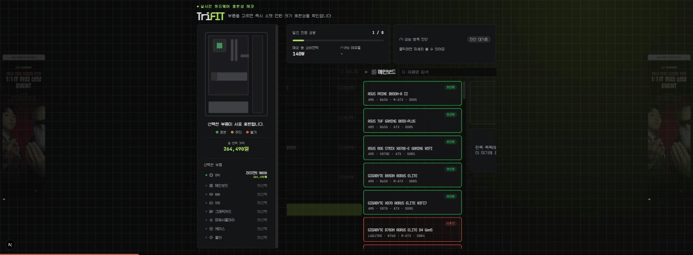

# TriFit (트라이핏)

> 부품을 하나씩 고르면 소켓·전원·크기 호환성을 그 자리에서 바로 확인해주는 PC 견적 도구

[](https://nextjs.org)
[](https://react.dev)
[](https://www.typescriptlang.org)
[](https://supabase.com)
[](https://pc-build-gold.vercel.app)

**Live Demo → [pc-build-gold.vercel.app](https://pc-build-gold.vercel.app)**

---

## 왜 만들었나

커스텀 PC를 조립할 때 소켓·전원 커넥터·크기가 안 맞아서 반품·재구매하는 경우가 많고, 초보자는 스펙표만 보고 호환 여부를 판단하기 어렵습니다. TriFit은 CPU부터 쿨러까지 8개 카테고리를 순서대로 고르면서, **선택하는 즉시** 규칙 기반으로 호환성을 검증하고 어디가 왜 안 맞는지 바로 알려줍니다.

## 데모

### 실시간 호환성 체크

부품을 고를 때마다 좌측 케이스 일러스트가 초록(호환)/노랑(주의)/빨강(불가)으로 즉시 반응합니다. 불가 상태여도 선택을 막지 않고 이유만 알려줍니다 — 최종 판단은 사용자가 합니다.



### AI 사전 추천

용도·예산 우선순위·브랜드 선호를 5단계로 답하면 LLM이 조합을 골라줍니다. 위험한 조합(소켓 불일치, 심한 성능 병목 등)은 사용자에게 노출되기 전에 자체 검증 후 같은 대화 맥락에서 AI에게 재요청하며, 계속 실패하면 검증된 안전 조합으로 대체합니다.


## 주요 기능

- **8개 카테고리 순차 선택**: CPU → 메인보드 → RAM → SSD → GPU → PSU → 케이스 → 쿨러
- **실시간 호환성 검증**: 소켓, 폼팩터, RAM 규격/속도, GPU 길이, PSU 전력·폼팩터·커넥터 세대(12VHPWR/12V-2x6), 쿨러 지원 소켓·높이·라디에이터 크기, M.2/PCIe 버전까지 검사
- **성능 병목 진단**: CPU-GPU 등급 격차를 계산해 병목 가능성을 경고
- **실시간 가격 조회**: 다나와 최저가를 크롤링해 부품별/합계 가격 표시 (`Crawl-delay: 10` 준수, 24시간 캐시)
- **AI 사전 추천 마법사**: Groq(Llama 3.3 70B)에게 조합을 요청 → 위험 조합 자체 검증 → 재시도 → 실패 시 안전 조합 폴백, 전체 60초 예산 내 처리
- **제품 이미지 연동**: 네이버쇼핑 검색 API로 부품 실사 이미지 표시
- **미쿠 에디션 이스터에그**: 선택 가능한 모든 카테고리를 하츠네 미쿠 에디션으로만 채우면 히든 업적 발동
- **개인정보처리방침 / 이용약관 페이지**, 광고 슬롯 포함

## 호환성 검증 규칙

| 항목 | 규칙 |
|---|---|
| CPU ↔ 메인보드 | 소켓 일치 |
| 메인보드 ↔ RAM | 규격(DDR4/5), 최대 속도, 최대 용량 이내 |
| GPU ↔ 케이스 | GPU 길이 ≤ 케이스 최대 GPU 장착 길이 |
| GPU ↔ PSU | PSU 용량 ≥ GPU 권장 용량, 커넥터 세대(12VHPWR/12V-2x6) 호환 |
| PSU ↔ 케이스 | PSU 폼팩터 일치 |
| 쿨러 ↔ CPU | 소켓 지원 여부, 최대 TDP 지원량 |
| 공랭 쿨러 ↔ 케이스 | 쿨러 높이 ≤ 케이스 최대 쿨러 높이 |
| 수랭 쿨러 ↔ 케이스 | 라디에이터 크기가 케이스 지원 목록에 포함 |
| SSD ↔ 메인보드 | NVMe인 경우 M.2 슬롯 존재, PCIe 버전 이내 |
| 메인보드 ↔ 케이스 | 폼팩터가 케이스 지원 목록에 포함 |

경고는 3단계(초록/노랑/빨강)로 표시되며, 빨강이어도 선택 자체를 막지 않습니다.

## 기술 스택

| 영역 | 사용 기술 |
|---|---|
| 프레임워크 | Next.js 15 (App Router), React 19, TypeScript |
| 스타일 | Tailwind CSS v4 |
| 애니메이션 | Framer Motion |
| 데이터베이스 | Supabase (Postgres) — 부품 스펙 데이터 |
| 스크래핑 | Cheerio — 다나와 실시간 최저가 조회 |
| AI | Groq API (Llama 3.3 70B) — 부품 조합 추천 |
| 외부 이미지 | 네이버쇼핑 검색 API |
| 배포 | Vercel |

## 시작하기

```bash
git clone https://github.com/qjqmf00331199-coder/PC_Build.git
cd PC_Build
npm install
```

`.env.local` 파일을 만들고 아래 값을 채워주세요 (`.env.example` 참고):

| 변수 | 설명 |
|---|---|
| `NEXT_PUBLIC_SUPABASE_URL` | Supabase 프로젝트 URL |
| `NEXT_PUBLIC_SUPABASE_PUBLISHABLE_KEY` | Supabase publishable key |
| `NAVER_CLIENT_ID` / `NAVER_CLIENT_SECRET` | [네이버 검색(쇼핑) API](https://developers.naver.com/apps) 키 — 제품 이미지 조회용 |
| `GROQ_API_KEY` | [Groq](https://console.groq.com/keys) API 키 — AI 추천 기능용 (Llama 3.3 70B) |

```bash
npm run dev
```

[http://localhost:3000](http://localhost:3000) 접속. 부품 데이터는 `supabase/` 폴더의 SQL 스크립트로 시딩합니다.

## 프로젝트 구조

```
src/
├── app/
│   ├── api/
│   │   ├── ai-recommend/    # Groq 기반 AI 추천 API
│   │   ├── danawa-price/    # 다나와 실시간 가격 크롤링
│   │   └── product-image/   # 네이버쇼핑 이미지 조회
│   └── page.tsx
├── components/
│   ├── build/                # 호환성 체커 UI (일러스트, 카테고리 카드, 진단 패널 등)
│   └── ai-recommend/         # AI 추천 마법사 UI
└── lib/
    ├── compatibility.ts      # 호환성 규칙 엔진
    ├── bottleneck.ts         # CPU-GPU 병목 진단
    ├── power-connector.ts    # GPU 전원 커넥터 세대 검증
    └── ai-recommend.ts       # AI 추천 프롬프트/검증 로직
```

## 데이터 출처 및 라이선스

- **부품 스펙·가격**: 다나와 (검색 결과 최초 1건 기준, 크롤링 정책 준수)
- **제품 이미지**: 네이버쇼핑 검색 API, 각 제조사
- **한글 폰트**: 마루 미냐 한글 (OFL 라이선스 — 상업적 이용·임베드 가능, 출처 표기 불필요, 수정·재배포 가능(OFL-1.1 채택 조건), 단독 판매만 금지)
- **캐릭터 이미지(미쿠 에디션)**: 온라인 공유용으로 제공되는 이미지, 비상업적 용도로 사용
- **광고 배너 이미지**: 원저작자에게 사용 허가받음
- **AI 추천**: Groq API (Llama 3.3 70B) 호출, 응답은 참고용 추천이며 최종 호환성은 자체 검증 로직을 통과한 것만 노출

본 프로젝트는 **학습 목적의 개인 프로젝트**이며, 언급된 제조사(AMD, Intel, NVIDIA, ASUS 등)와 공식 제휴 관계가 아닙니다. 상업적 이용을 목적으로 하지 않습니다.

## 다음 버전 계획

- 빌드 저장/공유 링크
- 로그인 및 마이 견적 관리
- 부품별 가격 비교(다중 쇼핑몰)

## License

학습 목적 개인 프로젝트로, 코드·에셋 전체 **비상업적 학습/열람 용도로만** 공개합니다. 재배포·2차 상업적 이용은 금지합니다.

- 코드: 학습·참고 목적의 열람/포크는 자유롭게 허용하나, 상업적 재배포는 금지
- 폰트(마루 미냐 한글)는 OFL 라이선스 원문을 따름
- 다나와 가격 데이터, 네이버쇼핑 이미지, 미쿠 캐릭터 이미지, 광고 이미지는 각 출처의 이용 약관을 따르며 이 프로젝트의 라이선스 범위에 포함되지 않음
- **AI 추천(Groq API) 관련 면책**: 본 프로젝트는 [Groq Services Agreement](https://console.groq.com/docs/legal/services-agreement)에 따라 Groq API를 호출함. 해당 약관상 Groq는 AI 모델 서비스 및 그 결과물(Output)에 대해 정확성·완전성을 보장하지 않으며 관련 책임을 명시적으로 배제하고(4.3조, 13조), Output의 사용에 대한 책임은 이용자(Customer)에게 있음(4.2조)을 규정함. 이에 따라 본 프로젝트가 노출하는 AI 추천 결과 역시 참고용이며, 실제 구매·조립 결정에 따른 책임은 최종 이용자 본인에게 있음
